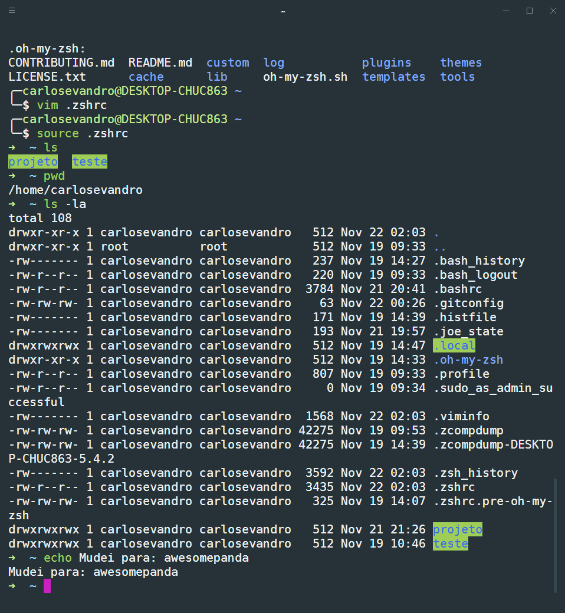

USO DO MARKDOWN
===============================================================

### O texto fica formatado similiar aos emails em texto puro de antigamente. Fica mais legível que o HTML, pois não tem TAGS para atrapalhar a leitura do código formatado, e os códigos utilizados no MarkDown parecem com a formatação de textos de email em ASCII, bastante populares antigamente, antes dos emails com texto em HTML se popularizarem.

-------------------------------------------------------------------------------------  
------------------------------------------------------------------------------------- 

## Dicas dos comandos de formatação do MARKDOWN.
 
## TÍTULOS:
```
Título com H1 (Setext-style) -> é só colocar um '=' ou mais na linha logo após o texto. 
=============================

Título com H2 (Setext-style)  -> é só colocar um '-' ou mais na linha logo após o texto.
-----------------------------

# Título com H1   (Atx-style) -> só começa a linha com 1 '#'
## Título com H2   (Atx-style) -> só começa a linha com 2 '#'
### Título com H3   (Atx-style) -> só começa a linha com 3 '#'
#### Título com H4   (Atx-style) -> só começa a linha com 4 '#'
##### Título com H5   (Atx-style) -> só começa a linha com 5 '#'
###### Título com H6   (Atx-style) -> só começa a linha com 6 '#'
```
## VEJA COMO FICA:  

Título com H1 (Setext-style) -> é só colocar um '=' ou mais na linha logo após o texto. 
=============================

Título com H2 (Setext-style)  -> é só colocar um '-' ou mais na linha logo após o texto.
-----------------------------

# Título com H1   (Atx-style) -> só começa a linha com 1 '#'
## Título com H2   (Atx-style) -> só começa a linha com 2 '#'
### Título com H3   (Atx-style) -> só começa a linha com 3 '#'
#### Título com H4   (Atx-style) -> só começa a linha com 4 '#'
##### Título com H5   (Atx-style) -> só começa a linha com 5 '#'
###### Título com H6   (Atx-style) -> só começa a linha com 6 '#' 

-------------------------------------------------------------------------------------  
-------------------------------------------------------------------------------------
# PARÁGRAFOS
É apenas uma ou mais linhas consecutivas de texto separadas por uma ou mais linhas em branco. Infelizmente, por causa dessa definição, 

Parágrafos normais não são indentados com espaços ou tabulações.

Se não quiser deixar uma ou mais linhas em branco entre dois parágrafos, terminar o primeiro parágrafo com 2 ou mais 'espaços'.  
Por exemplo, na linha anterior eu digitei 2 espaços e criou um parágrafo também, mas agora sem uma linha em branco entre os parágrafos.  

-------------------------------------------------------------------------------------  
-------------------------------------------------------------------------------------  

# Ênfase em um texto

```
*asterisco simples*  
_underscores simples_

**asterisco duplo**  
__underscores duplo__

```

*asterisco simples*  
_underscores simples_

**asterisco duplo**  
__underscores duplo__

**NOTA**: Pode ser utilizado no meio de uma palavra.  
Exemplo: 
```
Para*lele*pípedo
```
Para*lele*pípedo

```
Para\*lele\*pípedo

````

Para\*lele\*pípedo  

-------------------------------------------------------------------------------------  
-------------------------------------------------------------------------------------  
# Markdown supports a shortcut style for creating “automatic” links for URLs and email addresses

<http://example.com/>  

<email@host.com>

-------------------------------------------------------------------------------------  
-------------------------------------------------------------------------------------  

## BLOCKQUOTES (citações em bloco):  

```
>
> Esta é uma citação em bloco (blockquote).
> 
> Se digitar algum comando do MarkDown dentro de um blockquote, ele aparecerá.
>
```
>
> Esta é uma citação em bloco (*blockquote*).
> 
> Este é o primeiro nível de uma citação.  
>
>> Este é o segundo nível.
>
> > Este é o terceiro, e por aí vai...
> 
> Voltando para o primeiro nível.
> Tem que digitar algo para voltar ou então criar uma linha digitando no mínimo 3 '-', '_' ou '*'.
> 
> ___
> ***
> ---
## TESTE  DE NÍVEIS DAS CITAÇÕES EM BLOCO
>   
> Níveis:  
> > Nível 1  
>>>Nível 2  
>>>>Nível 3
>>>>>BNível 4
>>>>>>Nível 5  
>>>>>>>... XXXXXXXXXXXXXXX ... XXXXXXXXXXXXXXX ... XXXXXXXXXXXXXXX ...
>>>>>>---
>>>>>---
>>>>---
>>>---
>>---   
>
>
>> .
> 
>   
> 

-------------------------------------------------------------------------------------  
-------------------------------------------------------------------------------------  

Dando ênfase em alguma palavra ou trecho do texto.

    Some of these words *are emphasized*.

- Some of these words *are emphasized*.
-

    Some of these words _are emphasized also_.

- Some of these words _are emphasized also_.
- 

    Use two asterisks for **strong emphasis**.

- Use two asterisks for **strong emphasis**.
- 


    Or, if you prefer, __use two underscores instead__.

- Or, if you prefer, __use two underscores instead__.
  
  
  
Use the `printf()` function.

-------------------------------------------------------------------------------------  
------------------------------------------------------------------------------------- 
# IMAGENS




-------------------------------------------------------------------------------------  
-------------------------------------------------------------------------------------    
# LINKS

I get 10 times more traffic from [Google] [1] than from [Yahoo] [2] or [MSN] [3].  
[desafio 1] [4].

  [1]: http://google.com/        "Google"
  [2]: http://search.yahoo.com/  "Yahoo Search"
  [3]: http://search.msn.com/    "MSN Search"
  [4]: https://raw.githubusercontent.com/carlosevandro/bloco-de-anotacoes/master/aulas/aula_001/desafio1_aula001.PNG "IMAGEM DO DESAFIO 1"
      
  ---


I get 10 times more traffic from [Google][] than from
[Yahoo][] or [MSN][].  [desafio1][].

  [google]: http://google.com/        "Google"
  [yahoo]:  http://search.yahoo.com/  "Yahoo Search"
  [msn]:    http://search.msn.com/    "MSN Search"
  [desafio1]: https://raw.githubusercontent.com/carlosevandro/bloco-de-anotacoes/master/aulas/aula_001/desafio1_aula001.PNG "Imagem do desafio 1"
  ---  

  


-------------------------------------------------------------------------------------  


Vou listar alguns comandos que estamos aprendendo:

- `cd` (navega entre pastas)

Exemplo para entrar em uma pasta:
```
cd nomeDaPasta
```


Exemplo para sair de uma pasta:
```
cd ..
```

- `mkdir` (cria pastas) 

Exemplo de como criar uma pasta
```
mkdir nomeDaPasta
```

### Header 3

> This is a blockquote.
> 
> This is the second paragraph in the blockquote.
>
> ## This is an H2 in a blockquote

-------------------------------
Dando ênfase em alguma palavra ou trecho do texto.

    Some of these words *are emphasized*.

- Some of these words *are emphasized*.
-

    Some of these words _are emphasized also_.

- Some of these words _are emphasized also_.
- 

    Use two asterisks for **strong emphasis**.

- Use two asterisks for **strong emphasis**.
- 


    Or, if you prefer, __use two underscores instead__.

- Or, if you prefer, __use two underscores instead__.
  
  
  
Use the `printf()` function.

  ---  

<br />  
<br />  
<br />  

Quebra de Linhas  
================

<br />  
<br />
<br />  
<br />

    Chato usar o <br /> para quebra de várias linhas.
<br />  
<br />

.  
.  
.  


---

Marknown não substitui HTML. È utilizado por facilitar a digitação e convertido para o HTML. Para qualquer marcação que não é coberta pela sintaxe do Marknown, o usuário pode simplesmente utilizar HTML, porém existem algumas restrições. Elementos HTML de nível de bloco, como ```<div>, <table>, <pre>, <p>```, dentre outros, devem estar separados do conteúdo anterior e posterior do bloco por linhas em branco, e as tags de início e fim do bloco não devem ser indentadas com tabulações ou espaços.

    Exemplo:

	Texto antes do bloco, separado por um espaço em branco.

	<table>
		<tr>
			<td>Foo</td>
		</tr>
	</table>

	Texto depois do bloco, separado por um espaço em branco.
	Antes da tag tag <table> e </table> não existem espaços ou tabulações.

A sintaxe de formatação do Marknown **não é** processada dentro de tags HTML de nível de bloco.
	
*Span level HTML tags* (`<span>, <cite>, or <del>`) podem ser utilizadas em qualquer lugar. A sintaxe do Marknown é processada dentro de *span-level tags*.

In HTML, there are two characters that demand special treatment: 

< and &. 

Left angle brackets are used to start tags; 
ampersands are used to denote HTML entities. 
If you want to use them as literal characters, you must escape them as entities, e.g. &lt;, and &amp;.

Markdown allows you to use these characters naturally, taking care of all the necessary escaping for you. 
If you use an ampersand as part of an HTML entity, it remains unchanged; otherwise it will be translated into &amp;.

So, if you want to include a copyright symbol in your article, you can write:

&copy;

and Markdown will leave it alone. But if you write:

AT&T

Markdown will translate it to:

AT&amp;T

Similarly, if you use angle brackets as delimiters for HTML tags, Markdown will treat them as such. But if you write:

4 < 5

Markdown will translate it to:

4 &lt; 5

However, inside Markdown code spans and blocks, angle brackets and ampersands are always encoded automatically. This makes it easy to use Markdown to write about HTML code.

---
---

Marknown não substitui HTML. È utilizado por facilitar a digitação e convertido para o HTML. Para qualquer marcação que não é coberta pela sintaxe do Marknown, o usuário pode simplesmente utilizar HTML, porém existem algumas restrições. Elementos HTML de nível de bloco, como <div>, <table>, <pre>, <p>, dentre outros, devem estar separados do conteúdo anterior e posterior do bloco por linhas em branco, e as tags de início e fim do bloco não devem ser indentadas com tabulações ou espaços.

Exemplo:

	Texto antes do bloco, separado por um espaço em branco.

	<table>
		<tr>
			<td>Foo</td>
		</tr>
	</table>

	Texto depois do bloco, separado por um espaço em branco.
	Antes da tag tag <table> e </table> não existem espaços ou tabulações.

A sintaxe de formatação do Marknown **não é** processada dentro de tags HTML de nível de bloco.
	
*Span level HTML tags* (<span>, <cite>, or <del>) podem ser utilizadas em qualquer lugar. A sintaxe do Marknown é processada dentro de *span-level tags*.

In HTML, there are two characters that demand special treatment: 

< and &. 

Left angle brackets are used to start tags; 
ampersands are used to denote HTML entities. 
If you want to use them as literal characters, you must escape them as entities, e.g. &lt;, and &amp;.

Markdown allows you to use these characters naturally, taking care of all the necessary escaping for you. 
If you use an ampersand as part of an HTML entity, it remains unchanged; otherwise it will be translated into &amp;.

So, if you want to include a copyright symbol in your article, you can write:

&copy;

and Markdown will leave it alone. But if you write:

AT&T

Markdown will translate it to:

AT&amp;T

Similarly, if you use angle brackets as delimiters for HTML tags, Markdown will treat them as such. But if you write:

4 < 5

Markdown will translate it to:

4 &lt; 5

However, inside Markdown code spans and blocks, angle brackets and ampersands are always encoded automatically. This makes it easy to use Markdown to write about HTML code.

---


---


---

